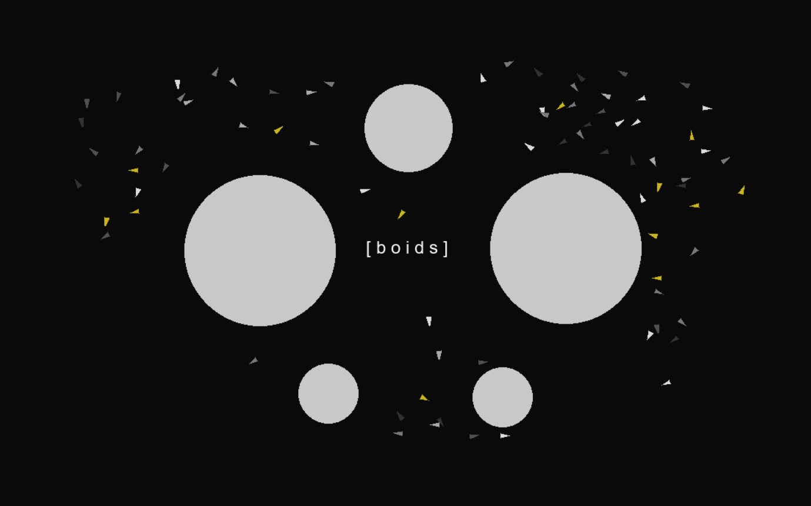

# Python Boids

## A python3 implementation of Boids. 

Boids (short for bird-oid) is the name for a specific type of simulation that represents flocking behavior commonly seen in animals such as fish and birds (hence the name). This is a python3 implementation of that simulation (with some added controls).

## Functionality:

- Core boid algorithm, simulating flocking behavior
- Advanced boid obstacle avoidance
- Easy switching between different modes:
  - Default regular boids simulation
  - Building: placing and removing obstacles, both circular and polygon-shaped
  - Follow mouse: boids will chase after the mouse pointer
  - Debugging: see which boids are neighbors, as well as which obstacles are "visible" to each boid
- Switch between a large selection of beautiful handpicked palettes
- Message display giving realtime feedback to the user
- Pausing / freezing of boid movement
- Resizable window

## Usage:
- Make sure `pygame` is installed: `$ python -m pip install pygame`
- Run with: `python main.py` (inside the parent directory)
- For controls see below

## Controls:

- `p`: pause / resume boids (stops boid movement)
- `LEFT/RIGHT (arrow)`: Change color palette
- `b`: activate build mode (allows one to place obstacles)
  - `SPACE`: switch between build modes ("default" <=> "polygon")
  - `LMB`: build circle obstacle (while in "default" build mode) / place polygon vertex (while in "polygon" build mode)
  - `RMB`: finish polygon (while in "polygon" build mode)
  - `R`: reset (remove) all built obstacles
  - `BACKSPACE`: remove most recently built obstacle
- `m`: activate mouse-following mode
- `d`: enable debug mode
- `ESC` / `q`: return to default mode.

## Context

This project was made by Jord van Eldik and Teun van Wezel during an introductory course on python programming at Utrecht University.
